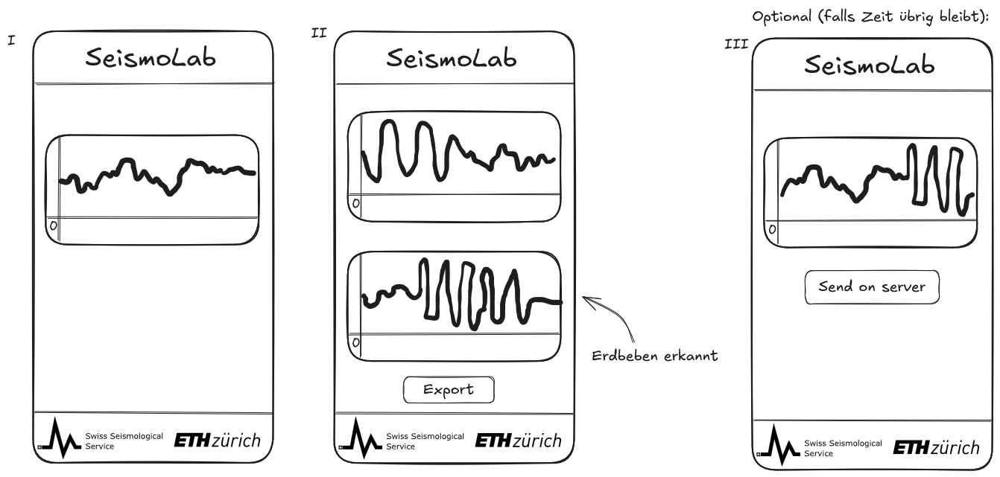

# SeismoLab

## Mockup



## App Beschreibung

SeismoLab ist eine mobile Anwendung zur Detektion und Visualisierung von möglichen Erdbebenereignissen mithilfe der eingebauten Smartphone-Sensoren. Die App verwendet die Daten des Accelerometer-Sensors, um kontinuierlich Bewegungen des Geräts zu messen und diese in Echtzeit grafisch darzustellen.  

Ein zentraler Bestandteil der Anwendung ist der Live-Graph, der die aufgenommenen Rohdaten visualisiert. Zusätzlich verarbeitet die App die Sensordaten intern mit einem STA/LTA-Verfahren (Short-Term Average / Long-Term Average), um auffällige Bewegungsmuster zu erkennen. Daraus wird eine charakteristische Funktion berechnet, die zur automatischen Erdbebendetektion dient. Überschreitet der berechnete Wert einen definierten Trigger-Schwellwert, erkennt die Anwendung ein mögliches Erdbebenereignis.  

Wird ein solches Ereignis erkannt, kann der User die aufgezeichneten Daten über einen Export-Button lokal auf dem Gerät speichern. Dadurch lassen sich relevante Messungen später analysieren.  

Optional kann die Anwendung erweitert werden, sodass erkannte Ereignisse zusätzlich an einen externen Server gesendet werden. Im Fall eines tatsächlichen Erdbebens könnten die Messdaten mehrerer Nutzer gesammelt und miteinander verglichen werden. Durch die Kombination dieser Daten mit seismologischen Referenzdaten wäre es möglich, das Epizentrum des Erdbebens näherungsweise zu bestimmen sowie betroffene Intensitätszonen wie „Scarcely Felt“, „Weak“, „Largely Observed“, „Strong“ oder „Slightly Damaging“ zu klassifizieren.

## App Start

### Voraussetzungen

Installieren:

- Node.js LTS
- Expo Go App auf dem Smartphone

Verwendete Versionen:

- Expo SDK: 54
- React Native: 0.81.5
- React: 19.1.0

### Node.js installieren

Node.js herunterladen und installieren:

<https://nodejs.org>

Nach der Installation prüfen:

```bash
node -v
npm -v
npx -v
```

### Projekt installieren

Projekt klonen und Dependencies installieren:

```bash
npm install
```

### App starten

Wichtig! Handy und Laptop müssen im gleichen Netzwerk sein!

```bash
npx expo start
```

Falls Netzwerkprobleme auftreten:

```bash
npx expo start --tunnel
```

## App auf Smartphone öffnen

1. Expo Go installieren
2. Smartphone und Laptop im selben WLAN verbinden
3. QR-Code im Terminal scannen

## Wichtige Hinweise

Dieses Projekt nutzt Expo SDK 54.

Falls automatisch falsche Versionen installiert werden:

```bash
npm install expo@~54.0.0
```

Bei Problemen Cache leeren:

```bash
npx expo start -c
```

Bei Dependency-Problemen:

```bash
rm -r -fo node_modules
del package-lock.json
npm install
```
